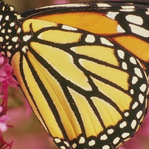

# PyTorch VDSR
Implementation of CVPR2016 Paper: "Accurate Image Super-Resolution Using 
Very Deep Convolutional Networks"(http://cv.snu.ac.kr/research/VDSR/) in PyTorch

## Usage
To use, run all cells for testVDSR.ipynb. Can change images from Set5 and load in.
The im_gt is the groundtruth image
The im_b is the interpolated low resolution image
- im_gt = Image.open("Set5/butterfly_GT.bmp").convert("RGB")
- im_b = Image.open("Set5/butterfly_GT_scale_4.bmp").convert("RGB")

The outputs are saved as testBCIm.JPEG (bicubic) and testHRIm.JPEG (VDSR High Res Output).

### Result
From left to right are ground truth, bicubic and vdsr

  
  
  

